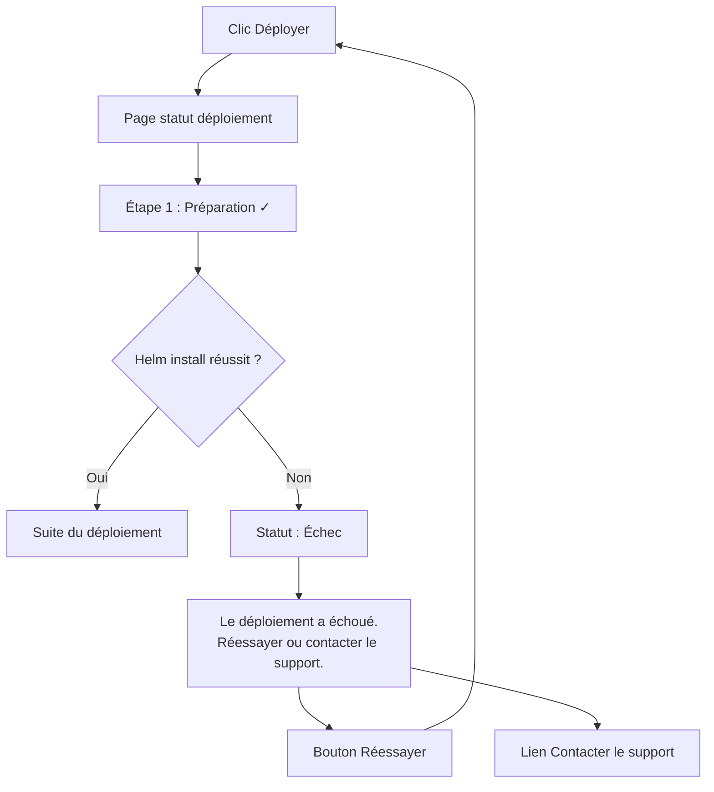
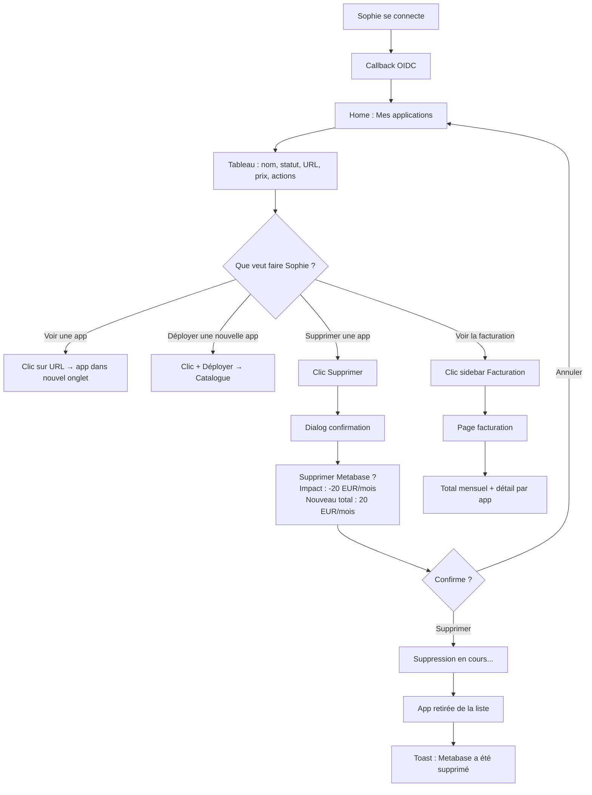
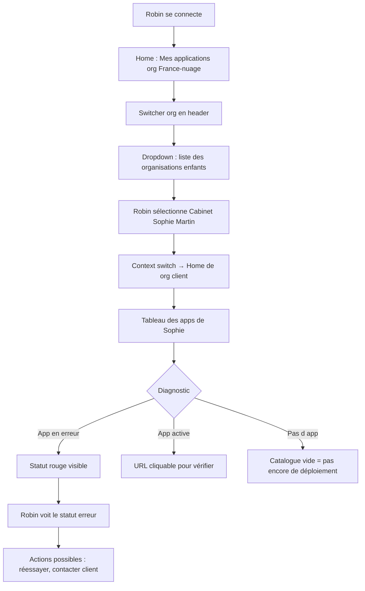

# UX Design Specification france-nuage

**Author:** Robin
**Date:** 2026-02-27

---

## Executive Summary

### Project Vision

France-nuage est un "app store" souverain pour les entreprises françaises. Le produit remplace l'assemblage manuel de briques open source (Nextcloud, Odoo, Metabase...) par un catalogue unique où un dirigeant non-technique déploie son SI complet en quelques clics. Le control plane orchestre automatiquement le provisionnement sur Kubernetes, la facturation via Stripe, et l'autorisation via SpiceDB — l'utilisateur ne voit qu'un formulaire simple et un bouton "Déployer".

La console web reprend l'architecture classique d'une console cloud (type GCP, Scaleway) : sélecteur organisation/projet en header, sidebar de navigation extensible, zone de contenu contextuelle. Cette architecture garantit l'extensibilité vers les couches basses (infra, VM, stockage) et les fonctionnalités avancées (rôles, monitoring, CLI). Au MVP, la simplicité vient du contenu — peu d'items sidebar, formulaires sans jargon — pas d'une architecture simplifiée qui limiterait l'évolution.

Le contexte géopolitique (Cloud Act, tensions US/EU) et la prise de conscience des dirigeants créent une fenêtre d'opportunité unique pour une alternative souveraine, simple, et centralisée.

### Target Users

**Utilisateur principal : Dirigeant non-technique (Sophie)**
- TPE/PME/ETI françaises (5 à 250 employés)
- Zéro compétence technique — ne connaît pas Docker, Kubernetes, Helm
- Critère de succès : "aussi simple qu'installer une app sur mon téléphone"
- Motivation : quitter Google Workspace / Microsoft 365 pour une solution souveraine
- Contexte d'usage : desktop principalement, en journée de travail, depuis le bureau
- Fréquence : configuration initiale (quelques sessions), puis consultation occasionnelle

**Utilisateur secondaire : Admin France-nuage (Robin)**
- Accède à la même console que les clients
- Visibilité sur toutes les organisations via la hiérarchie parent-enfant SpiceDB
- Besoin : diagnostiquer les problèmes clients sans outils séparés
- Fréquence : quotidienne, multiples organisations

**Hors console (MVP) : Équipe DevOps**
- Déclare les Helm charts et leurs variables directement en base de données
- Pas d'interface web au MVP

### Key Design Challenges

1. **Formulaires dynamiques humains** — Traduire les variables Helm (techniques) en formulaires compréhensibles pour un non-technicien. Labels clairs, descriptions contextuelles, validation en temps réel, zéro jargon. La qualité dépend des métadonnées fournies par les DevOps lors de la déclaration du chart.

2. **Feedback de provisionnement** — Le déploiement K8s est asynchrone et prend du temps. L'utilisateur doit comprendre l'état (en cours, succès, échec) sans anxiété. Le passage de "en cours" à "URL accessible" est le moment critique de l'expérience.

3. **Navigation Org → Projet → App** — Hiérarchie à trois niveaux compatible avec les conventions cloud (GCP, Scaleway). Switcher org/projet en header (pattern validé dans l'ancienne console), sidebar contextuelle. Au MVP, Sophie ne voit que quelques items — la complexité est latente, pas visible.

4. **Transparence tarifaire** — Afficher le prix avant le déploiement, la facturation globale par organisation, et l'impact financier de la suppression d'une app. Le modèle est simple (forfait mensuel par app), l'UX doit le refléter.

5. **Dualité cloud console / simplicité** — La console doit être extensible comme une console cloud classique (sidebar, org/projet, sections) tout en restant accessible à un dirigeant non-technique. Le squelette est cloud console, le contenu est app store. Si un conflit apparaît entre les deux, la simplicité prime au MVP et l'extensibilité structure les fondations.

### Design Opportunities

1. **Le "moment magique" du déploiement** — Sophie clique "Déployer", attend quelques secondes, et reçoit une URL fonctionnelle. Ce moment doit être célébré visuellement. C'est l'équivalent de l'installation d'une app sur smartphone — si ce moment est réussi, Sophie est convertie.

2. **Catalogue comme vitrine** — Premier contact avec la valeur de France-nuage. Chaque app affiche clairement son équivalent GAFAM ("Remplace Google Docs"). Cards visuelles avec logos, descriptions courtes, prix. Métaphore app store plutôt que console cloud.

3. **Console cloud accessible** — Les consoles cloud (AWS, GCP) sont puissantes mais intimidantes. Scaleway montre qu'on peut avoir l'architecture d'une console cloud avec une UX plus léchée. France-nuage peut aller plus loin : même architecture extensible, mais un contenu tellement simple qu'un dirigeant non-technique s'y retrouve. La simplicité n'est pas un compromis architectural, c'est un choix de contenu.

## Core User Experience

### Defining Experience

L'action qui définit la valeur de France-nuage est le **déploiement d'une application depuis le catalogue**. Tout le reste — créer une organisation, un projet, gérer sa facturation — est au service de cette action. Si un utilisateur non-technique peut déployer OnlyOffice en quelques clics et recevoir une URL fonctionnelle, le produit a tenu sa promesse.

Le parcours core suit un entonnoir simple :
1. **Découvrir** — Parcourir le catalogue, comprendre ce que fait chaque app
2. **Configurer** — Remplir un formulaire simple (pas de YAML, pas de CLI)
3. **Déployer** — Un bouton, un feedback visuel, une URL
4. **Utiliser** — L'app est accessible, l'abonnement est actif

### Platform Strategy

- **Web SPA desktop-first** — React + Chakra UI, architecture cloud console (GCP/Scaleway)
- **Responsive tablette** — Layout adaptatif, sidebar en drawer sur mobile (pattern validé dans l'ancienne console)
- **Pas de mobile-first** — Sophie configure son SI depuis son bureau, pas depuis son téléphone
- **Pas de mode offline** — Toutes les actions nécessitent le control plane
- **Pas d'app native** — La console web couvre 100% des besoins
- **Dark mode** — Supporté (hérité de l'ancienne console, via Chakra UI)

### Effortless Interactions

**Parcourir le catalogue :**
- Cards visuelles avec logo de l'application, nom, description courte, équivalent GAFAM, prix/mois
- Pas de pagination complexe au MVP (10 apps), grille simple
- Compréhension en 5 secondes : "je peux avoir tout ça, hébergé en France"

**Remplir le formulaire de déploiement :**
- Champs pré-remplis avec les valeurs par défaut quand c'est possible
- Validation en temps réel (pas de soumission pour découvrir les erreurs)
- Labels en français courant, descriptions contextuelles sous chaque champ
- Zéro jargon technique visible — les termes Helm, namespace, container n'apparaissent jamais

**Comprendre sa facturation :**
- Prix affiché sur chaque card du catalogue, avant toute action
- Récapitulatif du coût avant confirmation du déploiement
- Vue globale de la facturation par organisation : liste des apps + prix unitaire + total

**Gérer ses applications :**
- Liste des apps déployées avec statut visuel (actif, en cours, erreur)
- Suppression en un clic avec confirmation et affichage de l'impact billing ("vous ne serez plus facturé X EUR/mois")

### Critical Success Moments

1. **Premier déploiement réussi** — Si Sophie déploie sa première app sans aide, elle est convertie. Si elle bloque sur le formulaire ou ne comprend pas un champ, elle part. C'est le moment make-or-break de tout le produit.

2. **"L'URL fonctionne"** — Le passage de "déploiement en cours" à "votre application est accessible ici [lien cliquable]" doit être fluide et célébré. Un feedback visuel clair (progression, puis succès avec confetti ou animation subtile), un lien direct vers l'app.

3. **Compréhension instantanée du catalogue** — Sophie arrive sur le catalogue et comprend en 5 secondes que c'est la réponse à son besoin. Les cards, les équivalents GAFAM, les prix — tout doit communiquer : "c'est simple, c'est complet, c'est souverain".

4. **Suppression sereine** — Sophie supprime une app qu'elle n'utilise plus. La confirmation lui montre l'impact ("vous ne serez plus facturé 15 EUR/mois pour cette app"). Elle se sent en contrôle, pas piégée.

### Experience Principles

1. **App store, pas terminal** — Le vocabulaire, les visuels et les interactions empruntent à l'app store (cards, catégories, "installer"), pas à la console cloud (YAML, CLI, namespaces). Le squelette reste cloud console pour l'extensibilité, mais le langage est grand public.

2. **Un clic de la valeur** — Minimiser le nombre d'étapes entre "je veux cette app" et "elle tourne". Chaque écran intermédiaire doit justifier son existence. Si une étape peut être supprimée ou automatisée, elle doit l'être.

3. **Feedback permanent** — L'utilisateur sait toujours où il en est : statut de déploiement, état de ses apps, montant de sa facture. Pas de boîte noire, pas d'état inconnu, pas de silence après une action.

4. **Transparence par défaut** — Prix visible avant l'action, impact de la suppression affiché avant confirmation, pas de surprise. L'utilisateur ne découvre jamais un coût ou une conséquence après coup.

## Desired Emotional Response

### Primary Emotional Goals

**Soulagement** — L'émotion dominante. Sophie cherche depuis des mois une alternative à Google Workspace. Elle a vu que Nextcloud était compliqué, que les hébergeurs cloud parlent un langage qu'elle ne comprend pas. Elle arrive sur France-nuage, elle voit le catalogue, elle comprend en 5 secondes. "Enfin. Enfin une solution simple."

**Confiance** — Design professionnel, prix transparents, "hébergé en France" affiché clairement. Sophie ne doute pas de la légitimité du service. Pas de dark patterns, pas de surprise tarifaire, pas de jargon qui masque la complexité.

**Contrôle** — Sophie gère son SI elle-même. Elle voit ce qu'elle paie, elle peut ajouter/supprimer des apps à volonté. Elle n'est plus dépendante d'un prestataire technique ou d'un admin système.

**Fierté** — Après son premier déploiement : "J'ai fait ça toute seule, sans aide technique." Ce sentiment transforme une utilisatrice en ambassadrice.

### Emotional Journey Mapping

| Étape | Émotion visée | Émotion à éviter |
|---|---|---|
| Découverte du catalogue | Enthousiasme — "Tout ça, hébergé en France !" | Confusion — "C'est quoi tout ça ?" |
| Formulaire de déploiement | Sérénité — "C'est simple, je comprends" | Anxiété — "J'espère que je ne me trompe pas" |
| Pendant le déploiement | Anticipation — "Ça travaille pour moi" | Inquiétude — "Est-ce que ça a planté ?" |
| URL fonctionnelle | Fierté/satisfaction — "Ça marche !" | Déception — "Et maintenant ?" |
| En cas d'erreur | Compréhension — "Je sais quoi faire" | Panique — "J'ai tout cassé" |
| Consultation facturation | Contrôle — "Je maîtrise mon budget" | Surprise — "Je ne savais pas que ça coûtait ça" |
| Retour sur la console | Familiarité — "Je retrouve mes repères" | Désorientation — "Où est passé mon app ?" |

### Micro-Emotions

- **Confiance > Scepticisme** — Design sobre et professionnel, mentions souveraineté visibles, prix clairs. Pas de promesses exagérées.
- **Accomplissement > Frustration** — Chaque étape donne un feedback positif. Le formulaire valide en temps réel, le déploiement montre une progression, le succès est célébré.
- **Sérénité > Anxiété** — Pas de jargon, pas de messages alarmistes ("attention, cette action est irréversible"). Remplacer par des confirmations calmes et informatives.

### Design Implications

- **Soulagement** → Peu d'étapes, vocabulaire courant, pas de jargon. Le premier écran communique "c'est simple" avant même que l'utilisateur n'agisse. Espace visuel aéré, pas de surcharge d'informations.
- **Confiance** → Design sobre (pas de gadgets ni d'animations superflues), mentions "hébergé en France" discrètes mais présentes, prix toujours visibles avant chaque action. Cohérence visuelle sur toutes les pages.
- **Contrôle** → Prix affichés partout, impact des actions affiché avant confirmation, dashboard synthétique. L'utilisateur ne découvre jamais une conséquence après coup.
- **Fierté** → Célébration visuelle au premier déploiement réussi (animation subtile, message positif type "Votre application est prête"). Pas de condescendance, de la confirmation factuelle.
- **En cas d'erreur** → Message en français courant, cause identifiée si possible, action suggérée ("Réessayer" ou "Contacter le support à bonjour@france-nuage.fr"). Jamais de stack trace, jamais de code d'erreur technique visible.

### Emotional Design Principles

1. **Le calme inspire confiance** — Un design épuré et sobre communique la maîtrise. Éviter les animations excessives, les couleurs criardes, les notifications intrusives. Le produit doit respirer la sérénité d'un outil professionnel.

2. **Célébrer sans infantiliser** — Le succès mérite un feedback positif, mais adapté à un contexte B2B. "Votre application est prête" avec un lien direct, pas "Super ! 🎉". L'utilisateur est un dirigeant, pas un joueur.

3. **L'erreur n'est pas une faute** — Quand quelque chose échoue, le ton est factuel et constructif. "Le déploiement a échoué. Vous pouvez réessayer ou contacter notre équipe." Pas de "Oops!" ni de message culpabilisant.

4. **La transparence crée la fidélité** — Un utilisateur qui comprend exactement ce qu'il paie et ce qui se passe avec ses apps ne cherche pas d'alternative. La transparence est un investissement, pas un coût.

## UX Pattern Analysis & Inspiration

### Inspiring Products Analysis

**Scaleway Console**
- Cloud français avec console moderne, hiérarchie organisation/projet
- Forces UX : navigation claire (sidebar par catégorie de service), project switcher en header, design sobre et professionnel, documentation intégrée
- Limite : reste technique (cible développeurs), pas de métaphore "app store"
- Pertinent pour : le squelette cloud console, la navigation, le switcher org/projet

**Vercel**
- Plateforme de déploiement avec une expérience "magique"
- Forces UX : feedback de déploiement en temps réel (logs qui défilent, puis URL), onboarding minimal (3 étapes), dashboard ultra-épuré, statut visuel clair (vert/jaune/rouge)
- Limite : cible développeurs, pas de catalogue pré-packagé
- Pertinent pour : le feedback de provisionnement, le "moment magique", la simplicité du dashboard

**Shopify App Store**
- Catalogue d'apps pour non-techniciens (commerçants)
- Forces UX : cards avec logo/nom/description/prix, catégories claires, "Installer" en un clic, description en langage courant
- Limite : contexte e-commerce, pas cloud
- Pertinent pour : la présentation du catalogue, la métaphore app store, les cards d'application

**Stripe Dashboard**
- Référence en transparence billing B2B
- Forces UX : facturation limpide, chaque ligne compréhensible, historique clair, zéro surprise
- Pertinent pour : la page facturation, la transparence tarifaire

### Transferable UX Patterns

| Pattern | Source | Application France-nuage |
|---|---|---|
| Sidebar + project switcher en header | Scaleway, GCP | Shell console — navigation principale |
| Cards visuelles avec "Installer" | Shopify App Store | Catalogue d'applications |
| Feedback déploiement temps réel | Vercel | Provisionnement K8s — statut visuel progressif |
| Dashboard épuré avec statut coloré | Vercel | Page "Mes applications" — vert/jaune/rouge |
| Facturation ligne par ligne | Stripe | Page billing — liste apps + prix + total |
| Onboarding en 3 étapes max | Vercel | Premier parcours Sophie — org → projet → deploy |

### Anti-Patterns to Avoid

- **Console AWS** — Surcharge cognitive, centaines de services, jargon omniprésent, navigation labyrinthique. L'exact opposé de ce qu'on veut.
- **OVH Manager** — Interface datée, trop de niveaux de navigation, formulaires techniques avec des champs que seul un sysadmin comprend.
- **Heroku (fin de vie)** — Le pricing opaque et les limitations cachées ont détruit la confiance. Le modèle de simplicité était bon, la transparence a manqué.
- **Modals en cascade** — Certaines consoles cloud enchaînent les modals de confirmation. Préférer des pages dédiées avec récapitulatif clair.

### Design Inspiration Strategy

**Adopter :**
- Le shell Scaleway/GCP — sidebar extensible + switcher org/projet en header. Architecture éprouvée, extensible, familière pour les utilisateurs cloud.
- Les cards Shopify — catalogue visuel avec logo, description courte, prix, bouton "Installer". Rend le technique accessible.
- Le feedback Vercel — statut visuel progressif pendant le déploiement, puis URL cliquable au succès. Le "moment magique".

**Adapter :**
- Le dashboard Vercel — simplifier encore pour un non-technicien. Pas de logs, pas de commits. Juste : nom de l'app, statut (vert/jaune/rouge), URL, prix.
- La billing Stripe — adapter au modèle 1 app = 1 prix/mois. Liste simple : app + prix unitaire + total mensuel.

**Éviter :**
- La complexité AWS/OVH — pas de centaines d'options, pas de jargon, pas de navigation profonde.
- Le pricing opaque — chaque prix est visible avant l'action, chaque conséquence est affichée avant confirmation.
- Les modals en cascade — une confirmation suffit, avec un récapitulatif clair de l'action et de son impact.

## Design System Foundation

### Design System Choice

**Chakra UI v3** — Système thémable avec composants accessibles et personnalisables. Décision ferme validée dans l'architecture, confirmée par l'usage réussi dans l'ancienne console.

Approche : utiliser Chakra UI v3 tel quel avec une personnalisation minimale via les tokens de design. Pas de design system custom, pas de surcouche. Les composants Chakra couvrent 95% des besoins ; les 5% restants (cards catalogue, formulaire dynamique) sont des compositions de composants Chakra existants.

### Rationale for Selection

- **Déjà validé** — L'ancienne console France-nuage utilisait Chakra UI v3 avec succès. Les patterns sont connus et éprouvés.
- **Accessibilité intégrée** — ARIA attributes, focus management, keyboard navigation. Critique pour un produit B2B professionnel.
- **Composants formulaire complets** — Field, Input, Select, RadioCard, Switch. Essentiels pour les formulaires dynamiques Helm.
- **Dark mode natif** — ColorModeProvider + tokens sémantiques. Zéro effort additionnel.
- **Compatibilité agents IA** — Chakra UI v3 est massivement présent dans les données d'entraînement des LLMs. Les agents IA génèrent du code Chakra correct.
- **Timeline** — Pas le temps pour un design system custom. Chakra permet de produire une console professionnelle en quelques jours.

### Implementation Approach

**Tokens de design :**
- Palette de couleur primaire : `blue` (héritée de l'ancienne console, cohérente avec la marque France-nuage)
- Tokens sémantiques Chakra : `fg`, `fg.muted`, `fg.subtle`, `bg`, `bg.subtle`, `bg.panel`
- Typographie : defaults Chakra (système), tailles `sm` à `xl`
- Espacement : échelle Chakra (1 unité = 4px)

**Composants utilisés tels quels :**
- Layout : `Stack`, `Flex`, `Grid`, `Box`
- Navigation : `Drawer` (sidebar mobile), `Button` (ghost variant pour sidebar items)
- Formulaires : `Field.Root`, `Input`, `NativeSelect`, `RadioCard`, `Switch`
- Feedback : `Dialog` (confirmations), `Alert` (banners), `Toaster` (erreurs gRPC)
- Data : `Table` (base pour TanStack React Table)

**Composants composés (spécifiques France-nuage) :**
- `catalog-card.tsx` — Composition de `Box`, `Image`, `Text`, `Badge`, `Button`. Card visuelle pour le catalogue.
- `deploy-form.tsx` — Composition dynamique de `Field`, `Input`, `Select`, `RadioCard` selon les variables Helm.
- `project-switcher.tsx` — Composition de menus déroulants pour la sélection org/projet en header.
- `deployment-table.tsx` — TanStack React Table + composants Chakra `Table`.

### Customization Strategy

**Personnalisation minimale, composants maximaux.**

- Pas de thème custom complexe — tokens Chakra par défaut + palette `blue`
- Pas de composants custom quand un composant Chakra existe
- Les composants spécifiques France-nuage sont des compositions, pas des surcouches
- Le dossier `components/chakra/` contient uniquement le Provider et le Toaster (configuration), pas des composants redesignés
- Si un composant Chakra ne convient pas exactement, l'adapter via les props existantes plutôt que de le wrapper

## Defining Core Experience

### The Defining Experience

L'expérience définissante de France-nuage, celle qu'un utilisateur décrirait à un collègue :

**"Tu choisis une app dans le catalogue, tu remplis quelques champs, tu cliques Déployer, et en 2 minutes t'as ton OnlyOffice hébergé en France."**

C'est l'interaction qui, si elle est parfaitement exécutée, rend tout le reste secondaire. Le catalogue, la facturation, la gestion des projets — tout est au service de ce moment.

### User Mental Model

Sophie a un seul référentiel : **installer une app sur son téléphone**. App Store → chercher → installer → c'est prêt. C'est ce qu'elle attend.

**Ce qu'elle ne s'attend PAS à faire :**
- Lire de la documentation technique
- Choisir une "région" ou une "zone"
- Configurer un réseau, un DNS, un certificat SSL
- Attendre des heures ou des jours

**Son alternative actuelle :**
- Prestataire technique qui fait tout → cher, lent, opaque
- Rester sur Google Workspace → simple mais pas souverain
- Assembler elle-même des briques open source → impossible sans compétences techniques

France-nuage doit être aussi simple que Google Workspace, mais souverain.

### Success Criteria

1. Sophie déploie sa première app en moins de 15 minutes après inscription — tout compris (créer org, créer projet, choisir app, remplir formulaire, déployer)
2. Zéro terme technique visible pendant le parcours — si Sophie doit googler un mot, on a échoué
3. Tous les champs du formulaire sont compréhensibles sans tooltip — le label et la description suffisent
4. Le statut de déploiement est toujours clair — jamais de "chargement..." infini sans explication
5. Le prix est visible AVANT de cliquer "Déployer" — pas de surprise

### Novel UX Patterns

Patterns 100% établis, zéro innovation nécessaire côté utilisateur :
- Catalogue en cards → App Store, Shopify, tout marketplace
- Formulaire avec champs typés → tout SaaS du monde
- Indicateur de progression → pattern universel
- URL d'accès post-déploiement → Vercel, Heroku, Netlify

La seule particularité technique — le formulaire dynamique généré depuis les variables Helm — est **invisible pour l'utilisateur**. Sophie voit un formulaire classique. Le fait qu'il soit généré dynamiquement est un détail d'implémentation, pas une innovation UX.

### Experience Mechanics

**1. INITIATION**

Sophie est sur la page Catalogue. Elle voit les cards des 10 apps disponibles. Elle clique sur la card OnlyOffice (ou sur le bouton "Déployer" directement sur la card).

**2. INTERACTION**

- Page de déploiement : nom de l'app, description, prix/mois
- Formulaire dynamique : champs 100% définis par le Helm chart
  - Chaque app a ses propres variables (type, label, description, valeur par défaut, contraintes de validation)
  - Exemples possibles selon l'app : "Nom de votre instance", "Email administrateur", "Langue par défaut", "Espace de stockage"...
  - Certaines apps peuvent n'avoir aucun champ à remplir
- Récapitulatif : "OnlyOffice — 15 EUR/mois"
- Bouton "Déployer"
- Validation temps réel sur chaque champ

**3. FEEDBACK**

- Clic sur "Déployer" → bouton passe en loading
- Page/section de statut : étapes visuelles
  - "Préparation de votre application..."
  - "Configuration en cours..."
  - "Votre application est prête !"
- L'URL apparaît, cliquable
- Message : "Votre application OnlyOffice est accessible à l'adresse suivante"

**4. COMPLETION**

- Sophie clique sur l'URL → OnlyOffice s'ouvre dans un nouvel onglet
- Elle revient sur la console → l'app apparaît dans "Mes applications" avec statut vert, URL, prix
- Son abonnement Stripe est actif
- Elle peut déployer une autre app ou gérer celle-ci

## Visual Design Foundation

### Color System

**Palette primaire : `blue` (Chakra UI default)**
- Utilisée au niveau du layout racine (`colorPalette="blue"`)
- Cohérente avec la marque France-nuage et l'ancienne console
- Pas de couleurs hex hardcodées — tokens sémantiques Chakra exclusivement

**Mapping sémantique :**
- `blue` — Actions primaires (boutons "Déployer", liens, éléments actifs)
- `gray` — Éléments neutres (header, sidebar, texte secondaire)
- `green` — Statut succès (app active, déploiement réussi)
- `yellow` — Statut attention (déploiement en cours)
- `red` — Statut erreur et actions destructives (suppression, échec)

**Tokens sémantiques Chakra :**
- `fg` / `fg.muted` / `fg.subtle` — Hiérarchie de texte
- `bg` / `bg.subtle` / `bg.panel` — Hiérarchie de surfaces
- `colorPalette.fg` / `colorPalette.subtle` — Éléments interactifs contextuels

**Pas de thème custom** — `defaultSystem` Chakra UI v3 sans override. Les defaults sont professionnels, accessibles (contraste WCAG AA), et massivement connus des agents IA.

### Typography System

**Typographie système (Chakra default)** — Pas de font custom.

- Font-family : pile système (`-apple-system, BlinkMacSystemFont, "Segoe UI", ...`)
- Rendu natif sur chaque OS, chargement instantané, zéro requête réseau

**Échelle typographique :**
- `xl` — Titres de page ("Catalogue", "Mes applications")
- `lg` — Titres de section, noms d'app dans les cards
- `md` — Corps de texte, labels de formulaire
- `sm` — Descriptions, texte secondaire, métadonnées
- `xs` — Captions, badges, annotations

**Principes :**
- `fontWeight="medium"` pour les labels et éléments interactifs
- `fontWeight="normal"` pour le corps de texte
- `fontWeight="bold"` réservé aux titres de page
- Couleur texte via tokens sémantiques (`fg`, `fg.muted`, `fg.subtle`)

### Spacing & Layout Foundation

**Base d'espacement : échelle Chakra (1 unité = 4px)**
- `gap={1}` (4px) — Éléments très proches (icône + label)
- `gap={2}` (8px) — Éléments liés (champs de formulaire, items de liste)
- `gap={4}` (16px) — Sections au sein d'une page
- `gap={6}` (24px) — Séparation entre blocs majeurs
- `p={4}` (16px) — Padding interne des zones de contenu

**Layout principal :**
- Shell 100vh : header fixe + sidebar + zone de contenu scrollable
- Sidebar : 320px fixe (desktop), drawer overlay (mobile)
- Zone de contenu : `flex={1}`, `overflowY="auto"`, `p={4}`
- Breakpoint responsive : `lg` (sidebar visible vs drawer)

**Grille catalogue :**
- Cards en `Grid` responsive : 1 colonne (mobile), 2 colonnes (tablette), 3 colonnes (desktop)
- Gap entre cards : `gap={4}`

**Principes de layout :**
- Aéré, pas dense — un dirigeant non-technique a besoin d'espace visuel pour respirer
- Pas de surcharge d'informations — une action primaire par page
- Hiérarchie visuelle claire — le regard va du titre à l'action principale

### Accessibility Considerations

- **Contraste WCAG AA** — Garanti par les tokens Chakra par défaut (pas de couleurs custom à risque)
- **Focus visible** — Chakra gère le focus ring automatiquement sur tous les éléments interactifs
- **Navigation clavier** — Tous les composants Chakra supportent tab/enter/escape nativement
- **ARIA** — Attributs ARIA intégrés dans les composants Chakra (Dialog, Drawer, Menu, Field)
- **Dark mode** — Support complet via tokens sémantiques (pas de couleurs hardcodées)
- **Taille de texte minimale** — `sm` (14px) pour le texte le plus petit, jamais en dessous

## Design Direction Decision

### Design Directions Explored

Une seule direction explorée, car les contraintes convergent vers une réponse unique :
- **Architecture :** Cloud console (Scaleway/GCP) — décidée dans l'architecture
- **Design system :** Chakra UI v3 defaults — décidé dans l'architecture
- **Contenu :** App store (Shopify) — décidé dans la vision produit
- **Palette :** Blue Chakra — héritée de l'ancienne console

Explorer des directions alternatives serait artificiel et contre-productif avec une timeline d'1 mois.

### Chosen Direction

**"Cloud console shell + App store content"**

Un squelette de console cloud classique (sidebar, header avec switcher org/projet, zone de contenu) rempli avec un contenu simple et visuel (cards catalogue, formulaires pré-remplis, statuts colorés, facturation ligne par ligne).

Mockup interactif : `_bmad-output/planning-artifacts/ux-design-directions.html`

### Design Rationale

- **Extensibilité** — Le shell cloud console supporte l'ajout futur de sections (infra, monitoring, rôles) sans refonte
- **Familiarité** — Les utilisateurs techniques (admin France-nuage, futurs DevOps) retrouvent leurs repères
- **Simplicité** — Le contenu (cards, formulaires, tableaux simples) est accessible à un non-technicien
- **Cohérence** — L'ancienne console utilisait exactement ce pattern. Pas de rupture de mental model.
- **Rapidité d'implémentation** — Chakra UI v3 defaults + composants standard = production rapide

### Implementation Approach

**Pages identifiées (6 écrans MVP) :**
1. `catalog.page.tsx` — Grille de cards, navigation vers le déploiement
2. `deploy.page.tsx` — Formulaire dynamique + récapitulatif prix + bouton "Déployer"
3. `home.page.tsx` — Tableau "Mes applications" (statut, URL, prix, actions)
4. `billing.page.tsx` — Total mensuel + détail par application
5. `login.page.tsx` — Redirection OIDC Keycloak
6. `oidc-redirect.page.tsx` — Callback OIDC

**Composants shell :**
- `app-layout.tsx` — Shell 100vh (header + sidebar + content)
- `app-header.tsx` — Logo + switcher org/projet + avatar
- `app-sidebar.tsx` — Items de navigation (3 au MVP)

**Patterns d'interaction :**
- Confirmation de suppression : Dialog avec impact billing
- Feedback de déploiement : étapes visuelles avec progression animée
- Statuts : badges colorés (vert actif, jaune en cours, rouge erreur)

## User Journey Flows

### Parcours 1 : Premier déploiement (Sophie)

**Contexte :** Sophie arrive pour la première fois. Elle doit créer son organisation, un projet, et déployer sa première application. C'est le parcours le plus critique — si Sophie réussit, elle est convertie.

**Points de décision clés :**
- Création du customer Stripe (avant le premier déploiement, flux séparé)
- Choix de l'application dans le catalogue
- Remplissage du formulaire dynamique

```mermaid
flowchart TD
    A[Sophie arrive sur france-nuage.fr] --> B[Clic 'Se connecter']
    B --> C[Redirection Keycloak OIDC]
    C --> D{Compte existant ?}
    D -->|Non| E[Inscription Keycloak]
    D -->|Oui| F[Connexion Keycloak]
    E --> F
    F --> G[Callback OIDC → Console]
    G --> H{User existe en BDD ?}
    H -->|Non| I[Création user depuis token ID]
    H -->|Oui| J[Chargement console]
    I --> J

    J --> K{A une organisation ?}
    K -->|Non| L[Page : Créer votre organisation]
    K -->|Oui| M[Home : Mes applications]
    L --> N[Saisie nom organisation]
    N --> O[Organisation créée]
    O --> P[Page : Créer votre premier projet]
    P --> Q[Saisie nom projet]
    Q --> R[Projet créé → Redirection catalogue]

    R --> S[Catalogue : grille de cards]
    M --> S
    S --> T[Sophie clique sur une app]
    T --> U[Page de déploiement : formulaire dynamique]

    U --> V{Customer Stripe existe ?}
    V -->|Non| W[Formulaire Stripe : saisie carte bancaire]
    V -->|Oui| X[Formulaire pré-rempli]
    W --> X
    X --> Y[Sophie remplit les champs]
    Y --> Z[Récapitulatif : app + prix/mois]
    Z --> AA[Clic 'Déployer']

    AA --> AB[Page statut déploiement]
    AB --> AC[Étape 1 : Préparation ✓]
    AC --> AD[Étape 2 : Configuration ✓]
    AD --> AE[Étape 3 : Mise en service ✓]
    AE --> AF[Étape 4 : Vérification ✓]
    AF --> AG[Votre application est prête ! URL cliquable]

    AG --> AH{Sophie clique sur URL ?}
    AH -->|Oui| AI[App s ouvre dans nouvel onglet]
    AH -->|Non| AJ[Retour Home : app visible dans la liste]
```

**Cas d'erreur :**

### Parcours 2 : Gestion quotidienne (Sophie)

**Contexte :** Sophie a plusieurs apps déployées. Elle se connecte pour vérifier ses apps, éventuellement en supprimer une.

### Parcours 3 : Admin France-nuage (Robin)

**Contexte :** Robin est admin de l'organisation racine. Un client signale un problème. Robin doit naviguer vers l'organisation du client pour diagnostiquer.

### Journey Patterns

**Patterns de navigation :**
- **Context switch org/projet** — Le switcher en header change le contexte de toute la page. Toutes les données affichées sont filtrées par l'organisation et le projet sélectionnés.
- **Entry point unique** — Toute session commence par Home (Mes applications). Le catalogue est accessible depuis la sidebar ou le bouton "+ Déployer".

**Patterns de décision :**
- **Confirmation avec impact** — Toute action destructive (suppression) affiche l'impact billing avant confirmation. Jamais de confirmation générique "Êtes-vous sûr ?".
- **Onboarding progressif** — Si l'utilisateur n'a pas d'organisation → créer une org. Pas d'org → pas de projet → pas de catalogue. Chaque étape mène à la suivante naturellement.

**Patterns de feedback :**
- **Statut visuel coloré** — Vert (actif), jaune animé (en cours), rouge (erreur). Visible partout : tableau d'apps, page de déploiement.
- **Toast post-action** — Confirmation éphémère après une action réussie ("Application supprimée", "Organisation créée").
- **Progression par étapes** — Le déploiement montre des étapes successives avec checkmarks, pas un spinner indéterminé.

### Flow Optimization Principles

1. **Onboarding en entonnoir** — Org → Projet → Catalogue → Deploy. Chaque étape redirige vers la suivante. Sophie n'a jamais à chercher quoi faire ensuite.
2. **Customer Stripe séparé** — La saisie de carte bancaire est demandée une seule fois, avant le premier déploiement. Les déploiements suivants n'ont plus cette étape.
3. **Zéro état vide sans action** — Si la liste d'apps est vide, afficher un call-to-action vers le catalogue, pas un tableau vide.
4. **Retour naturel** — Après un déploiement réussi, Sophie peut cliquer l'URL ou revenir à Home. Les deux options sont visibles.
5. **Erreur = action** — Chaque état d'erreur propose une action concrète (réessayer, contacter le support). Jamais de cul-de-sac.

## Component Strategy

### Design System Components

**Chakra UI v3 — Composants utilisés directement :**

| Besoin | Composant Chakra | Usage |
|---|---|---|
| Layout page | `Stack`, `Flex`, `Box` | Shell, zones de contenu |
| Grille catalogue | `Grid` | Grille responsive de cards |
| Formulaires | `Field.Root`, `Input`, `NativeSelect`, `RadioCard` | Formulaire dynamique Helm |
| Confirmations | `Dialog` + `Portal` | Suppression d'app |
| Sidebar mobile | `Drawer` | Navigation responsive |
| Navigation sidebar | `Button` variant ghost | Items sidebar |
| Erreurs globales | `Toaster` | Erreurs gRPC interceptées |
| Banners | `Alert.Root` | Messages informatifs (support) |
| Tableaux | `Table` | Base pour TanStack React Table |
| Badges statut | `Badge` | Statut app (actif, en cours, erreur) |
| Dark mode | `ColorModeProvider` | Bascule light/dark |

Aucun composant Chakra manquant — tous les besoins sont couverts. Les composants custom sont des compositions.

### Custom Components

**Shell (3 composants) :**

**`app-layout.tsx`**
- But : Shell principal de l'application (100vh)
- Contenu : Header + Sidebar (desktop) / Drawer (mobile) + Zone de contenu (Outlet)
- États : Sidebar ouverte/fermée (responsive `lg`)
- Composition : `Box` > `Stack` > `AppHeader` + `Flex` > `AppSidebar` + `Stack` > `Outlet`

**`app-header.tsx`**
- But : Barre de navigation supérieure
- Contenu : Logo France-nuage, switcher org/projet, avatar utilisateur, toggle dark mode
- États : Desktop (tout visible) / Mobile (hamburger + logo)
- Composition : `Flex` > logo + `ProjectSwitcher` + `Avatar`

**`app-sidebar.tsx`**
- But : Navigation principale
- Contenu : Sections ("Applications", "Organisation") avec items (Catalogue, Mes apps, Facturation)
- États : Item actif (`aria-current="page"`), hover
- Composition : `Stack` > sections (`Text` uppercase) + items (`Button` ghost)
- Accessibilité : Navigation landmark, `aria-current` sur l'item actif

**Navigation (1 composant) :**

**`project-switcher.tsx`**
- But : Sélecteur d'organisation et de projet en header
- Contenu : Dropdown org + séparateur "/" + dropdown projet
- États : Fermé, ouvert (dropdown), chargement
- Comportement : Changer l'org filtre les projets, changer le projet filtre les données de la page
- Composition : `Flex` > 2x `Menu` Chakra
- Redux : Dispatch `organizations/select` et `projects/select` au changement

**Catalogue (1 composant) :**

**`catalog-card.tsx`**
- But : Card d'application dans le catalogue
- Contenu : Icône/logo, nom, équivalent GAFAM, description courte, prix/mois, bouton "Déployer"
- États : Default, hover (border blue, shadow, translateY)
- Composition : `Box` (border, radius) > `Flex` (icon + title) + `Text` (desc) + `Flex` (prix + `Button` primary)
- Accessibilité : Card focusable, `role="article"`, bouton séparé pour le déploiement

**Déploiement (2 composants) :**

**`deploy-form.tsx`**
- But : Formulaire dynamique généré depuis les variables Helm
- Contenu : Header (icône + nom app + description), champs dynamiques, récapitulatif prix, bouton "Déployer"
- Comportement : Reçoit un tableau de variables `{name, type, label, description, default, validation}`, génère les champs correspondants
- Types de champs : `text` → `Input`, `email` → `Input type=email`, `select` → `NativeSelect`, `boolean` → `Switch`, `radio` → `RadioCard`
- États : Default, validation erreur par champ, loading (bouton + champs disabled)
- Accessibilité : `Field.RequiredIndicator` sur les champs obligatoires, `aria-describedby` pour les hints

**`deployment-status.tsx`**
- But : Feedback visuel du déploiement en cours
- Contenu : Icône app, titre, liste d'étapes avec statut (done ✓, active ⋯, pending ○), durée estimée
- États : En cours (étapes progressent), succès (URL cliquable), échec (message + bouton réessayer)
- Accessibilité : `aria-live="polite"` sur la zone de statut, `role="status"`

**Applications déployées (2 composants) :**

**`deployment-table.tsx`**
- But : Tableau des applications déployées
- Contenu : Colonnes : nom (icône + nom), statut (badge coloré), URL (lien), prix, actions (supprimer)
- États : Avec données, vide (empty state avec CTA)
- Composition : TanStack React Table + Chakra `Table` + `Badge` pour les statuts

**`empty-state.tsx`**
- But : État vide quand aucune app n'est déployée
- Contenu : Icône, titre ("Aucune application"), description, bouton CTA ("Parcourir le catalogue")
- Composition : `Stack` centré > icône + `Text` + `Button` primary

**Facturation (1 composant) :**

**`billing-summary.tsx`**
- But : Récapitulatif de facturation
- Contenu : Total mensuel (grand chiffre), détail par app (ligne : icône + nom + prix), total en bas
- Composition : `Box` (card) > `Text` total + `Stack` (lignes) + séparateur + total

**Auth (1 composant) :**

**`page-guard.tsx`**
- But : Protection des routes authentifiées
- Comportement : Redirige vers /login si pas authentifié, redirige vers / si authentifié et sur /login
- Composition : Logique pure (pas de rendu visuel), wraps `Outlet`

### Component Implementation Strategy

**Règle : composition uniquement, jamais de wrapper.**

Chaque composant custom est une composition de composants Chakra. Pas de couche d'abstraction entre le code France-nuage et Chakra. Si `Button` a besoin de props spécifiques, on les passe directement — on ne crée pas un `FnButton`.

**Dossier `components/chakra/` :** Réservé à la configuration Chakra (Provider, Toaster). Pas de composants redesignés.

**Préfixe domaine :** Chaque composant est préfixé par son domaine fonctionnel (`catalog-`, `deploy-`, `billing-`, `app-`, `deployment-`). Pas de sous-dossiers par feature.

### Implementation Roadmap

**Phase 1 — Shell + Auth (bloquant tout le reste) :**
- `app-layout.tsx`, `app-header.tsx`, `app-sidebar.tsx`
- `page-guard.tsx`
- `project-switcher.tsx`
- Pages : `login.page.tsx`, `oidc-redirect.page.tsx`

**Phase 2 — Catalogue + Déploiement (parcours core) :**
- `catalog-card.tsx`
- `deploy-form.tsx`
- `deployment-status.tsx`
- Pages : `catalog.page.tsx`, `deploy.page.tsx`

**Phase 3 — Gestion + Billing (parcours quotidien) :**
- `deployment-table.tsx`
- `empty-state.tsx`
- `billing-summary.tsx`
- Pages : `home.page.tsx`, `billing.page.tsx`

## UX Consistency Patterns

### Button Hierarchy

**3 niveaux de boutons, pas plus :**

| Niveau | Variant | Usage | Exemple |
|---|---|---|---|
| Primary | Blue solid | Action principale de la page — une seule par écran | "Déployer", "Créer" |
| Outline | Gray border | Actions secondaires | "Annuler", "Supprimer" (non-destructif) |
| Danger | Red solid | Actions destructives dans les Dialogs | "Supprimer" (confirmation) |

**Règles :**
- Un seul bouton primary par page — si deux actions sont primaires, l'une est mal classée
- Le bouton primary est toujours à droite dans les paires (Annuler / Déployer)
- Loading state : `loading={isPending}` + `loadingText` — jamais un spinner nu
- Pleine largeur pour les actions finales de formulaire
- `btn-sm` pour les actions inline dans les tableaux

### Feedback Patterns

**Toast (erreurs gRPC et confirmations éphémères) :**
- Position : en haut à droite (desktop), en haut centré (mobile)
- Debounce 500ms (évite le spam si plusieurs appels échouent)
- Durée : 5 secondes, auto-dismiss
- Types : `success` (vert), `error` (rouge), `info` (blue)
- Contenu : une phrase courte, en français courant

**Alert (banners persistants) :**
- Usage : messages de support, information système, onboarding
- Position : en haut de la zone de contenu, avant le contenu de la page
- Exemple : "Besoin d'aide ? Contactez-nous à bonjour@france-nuage.fr"

**Statuts colorés (applications déployées) :**
- Vert (`green`) + dot → Active
- Jaune (`yellow`) + dot pulse animé → Déploiement en cours
- Rouge (`red`) + dot → Erreur
- Toujours un label texte en plus de la couleur (accessibilité)

**Empty states :**
- Jamais de tableau vide sans explication
- Structure : icône + titre + description + bouton CTA
- Exemple : "Aucune application déployée. Parcourez le catalogue pour commencer."

### Form Patterns

**Structure de champ :**
- `Field.Root` > `Field.Label` + `Field.RequiredIndicator` (si requis)
- Hint sous le label (`Text` sm, fg.muted)
- Input / Select / RadioCard / Switch
- Erreur sous le champ (`Text` sm, red) — affichée en temps réel

**Validation :**
- Temps réel au blur (onBlur), pas à la soumission ni à la frappe
- Inline sous le champ concerné, pas en haut du formulaire
- Français courant : "Ce champ est requis" plutôt que "Required field"

**Formulaire dynamique (deploy-form) :**
- Champs générés depuis les variables Helm : `{name, type, label, description, default, validation}`
- Mapping type → composant : `text` → `Input`, `email` → `Input type=email`, `select` → `NativeSelect`, `boolean` → `Switch`, `radio` → `RadioCard`
- Valeurs par défaut pré-remplies quand disponibles
- Récapitulatif prix toujours visible en bas, avant le bouton

**Soumission :**
- Bouton en `loading` avec `loadingText`
- Champs en `disabled`
- Pas de double soumission possible

### Navigation Patterns

**Sidebar :**
- Items regroupés par section (titre uppercase `xs`, gris)
- Item actif : background blue subtle + border-left blue + font-weight medium
- Hover : background gray subtle
- Mobile : masquée, Drawer overlay via hamburger

**Context switching (org/projet) :**
- Switcher dans le header, visible en permanence : `[Org ▾] / [Projet ▾]`
- Changer l'org → reset projet → rechargement données
- Changer le projet → rechargement données de la page
- Données toujours filtrées par le contexte org/projet courant

**Routes MVP :**
- `/login` — Redirection OIDC
- `/auth/redirect/:provider` — Callback OIDC
- `/` — Home (Mes applications)
- `/catalog` — Catalogue
- `/catalog/:appId/deploy` — Formulaire de déploiement
- `/billing` — Facturation
- Toutes les routes protégées par `page-guard` sauf login et callback

### Loading States

- **Boutons :** `loading={true}` + `loadingText` — le texte indique ce qui se passe
- **Pages :** Skeleton Chakra ou spinner centré pendant le chargement initial
- **Tableaux :** Skeleton rows. Si échec → Alert d'erreur + bouton "Réessayer"
- **Déploiement :** Étapes visuelles step-by-step, pas de spinner indéterminé

### Dialog Patterns

**Quand :** Actions destructives uniquement (suppression d'app). Jamais pour navigation ou information.

**Structure :**
- Titre : question directe ("Supprimer Metabase ?")
- Description : conséquence de l'action
- Impact billing : section dédiée ("Vous ne serez plus facturé X EUR/mois")
- Actions : Annuler (outline, gauche) + Confirmer (danger, droite)
- `lazyMount` + `Portal`

**Règles :**
- Pas de Dialogs en cascade
- Pas de Dialog pour actions non-destructives
- "Annuler" ferme le Dialog, rien d'autre

### Content Language

**Langue :** Français exclusivement dans l'interface.

**Ton :** Professionnel, factuel, sans jargon technique.

**Règles :**
- Pas d'anglicismes quand un équivalent français existe ("Déployer" pas "Deploy")
- Exception : noms d'applications en anglais (OnlyOffice, Metabase)
- Pas d'émojis dans l'interface (sauf icônes d'app dans le catalogue)
- Pas de "Oops!", "Bravo!", "Super!" — factuel et adulte
- Messages d'erreur constructifs : cause + action ("Le déploiement a échoué. Vous pouvez réessayer ou contacter notre équipe.")

## Responsive Design & Accessibilité

### Stratégie Responsive

**Approche : Desktop-first**

France-nuage est une console d'administration B2B. L'usage principal est sur desktop, au bureau. L'expérience complète est conçue pour desktop, puis dégradée gracieusement pour tablette. Le mobile n'est pas une cible MVP.

- **Desktop (≥ 1024px)** : Expérience complète. Sidebar fixe 280px + zone de contenu fluide. Formulaires en colonne unique avec recap latéral (deploy). Tableaux complets avec toutes les colonnes.
- **Tablette (768px – 1023px)** : Sidebar se rétracte en Drawer accessible via bouton hamburger. Formulaires pleine largeur, recap passe au-dessus du formulaire. Tableaux avec colonnes secondaires masquées (scroll horizontal si nécessaire).
- **Mobile (< 768px)** : Non optimisé au MVP. La console reste fonctionnelle (responsive Chakra par défaut) mais aucun effort de design spécifique. Les cards du catalogue passent en colonne unique.

### Stratégie de Breakpoints

Utilisation des breakpoints natifs Chakra UI v3 — aucun breakpoint custom :

| Token | Valeur | Usage |
|-------|--------|-------|
| `sm` | 480px | Non utilisé au MVP |
| `md` | 768px | Passage tablette : sidebar → drawer |
| `lg` | 1024px | Desktop standard |
| `xl` | 1280px | Desktop large : grille catalogue 4 colonnes |
| `2xl` | 1536px | Non utilisé au MVP |

Le breakpoint clé est `md` : en dessous, la sidebar devient un Drawer (composant Chakra) déclenché par un bouton hamburger dans le header.

### Stratégie Accessibilité

**Niveau cible : WCAG 2.1 AA** — standard de l'industrie, couvert nativement par Chakra UI v3.

**Ce que Chakra UI v3 fournit automatiquement :**
- Contrastes de couleur conformes AA via les palettes intégrées
- Gestion du focus (focus-visible, focus trap dans les Dialog/Drawer)
- Rôles ARIA sur tous les composants (Button, Dialog, Menu, etc.)
- Keyboard navigation (Tab, Escape, Enter, Space, Arrow keys)
- Touch targets ≥ 44x44px sur les composants interactifs

**Ce que nous devons assurer manuellement :**
- `aria-label` sur les IconButton (bouton hamburger, bouton fermer)
- `aria-current="page"` sur l'item sidebar actif
- `aria-live="polite"` sur les zones de status (déploiement en cours, toasts)
- Labels explicites sur tous les champs de formulaire dynamiques (le champ `label` du Helm chart variable)
- Skip link "Aller au contenu" en haut de page
- Alt text sur les logos d'applications dans le catalogue

Pas de mode dark au MVP (mode clair uniquement, cohérent avec l'ancienne console).

### Stratégie de Test

**Responsive :**
- Tests Playwright E2E sur viewport desktop (1280×720) — viewport principal
- Un viewport tablette (768×1024) pour valider le passage sidebar → drawer
- Pas de tests mobile dédiés au MVP

**Accessibilité :**
- `axe-core` intégré aux tests Playwright (via `@axe-core/playwright`) pour détecter les violations AA automatiquement
- Vérification manuelle keyboard-only sur les flux critiques (déploiement, suppression)
- Pas de tests screen reader dédiés au MVP — Chakra couvre les bases

### Guidelines d'Implémentation

**Responsive :**
- Utiliser les responsive props Chakra : `<Grid columns={{ base: 1, md: 2, xl: 4 }}>` — pas de media queries CSS manuelles
- Unités relatives (`rem`) pour les tailles de texte, `%` ou tokens Chakra pour les espacements
- Images d'apps du catalogue : format fixe (icônes), pas besoin de `srcset`
- Sidebar : composant `Show` de Chakra pour le toggle desktop/drawer

**Accessibilité :**
- HTML sémantique : `<nav>` pour la sidebar, `<main>` pour le contenu, `<header>` pour le header
- `<form>` avec `<fieldset>` et `<legend>` pour les formulaires de déploiement
- Toasts Chakra (déjà `role="status"` + `aria-live="polite"`)
- Dialog de confirmation : focus automatiquement placé sur le bouton "Annuler" (pas le destructif)
